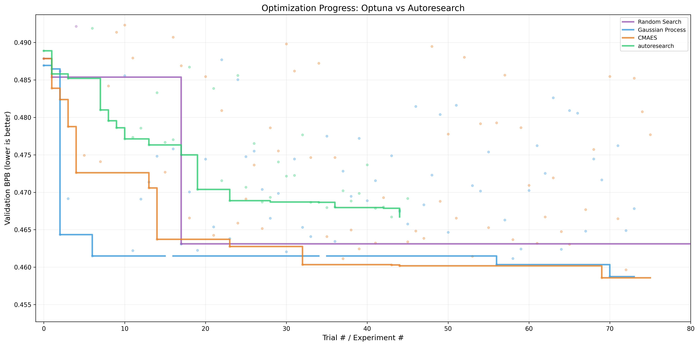

# Autoresearch Is Just Hyperparameter Optimization with Extra Steps



This repo is a fork of [autoresearch](https://github.com/karpathy/autoresearch) that implements **classical hyperparameter optimization** using [Optuna](https://optuna.org/). It compares autoresearch with three different search algorithms (Random, Gaussian Process, CMA-ES) to find the most optimal hyperparameters for a fixed 5-minute training budget on a single GPU.
The code was adapted for a smaller GPU (RTX 3060) and trains on [TinyStories-gpt4-clean](https://huggingface.co/datasets/karpathy/tinystories-gpt4-clean) as instructed by the original repository.
Experiments don't run for exactly five minutes because I could not find the FLOPS of this GPU (used to calculate compute budget).

If you are looking for the original instructions on how to run the AI agent, please check out the git label `for-agent`:
```bash
git checkout for-agent
```

## How it works

The repo is deliberately kept small and only really has a few files that matter:

- **`prepare.py`** — fixed constants, one-time data prep (downloads training data, trains a BPE tokenizer), and runtime utilities (dataloader, evaluation). Not modified.
- **`train.py`** — the single file that runs hyperparameter optimization via Optuna. Contains the full GPT model, optimizer (Muon + AdamW), and training loop.
- **`run_hyperopt.sh`** — a bash script that runs sequential optimization studies for 8 hours each using different Optuna samplers (Random, GP, CMA-ES).

By design, training runs for a **fixed 5-minute time budget** (wall clock, excluding startup/compilation), regardless of the details of your compute. The metric is **val_bpb** (validation bits per byte) — lower is better, and vocab-size-independent, so architectural changes are fairly compared.

## Quick start

**Requirements:** A single NVIDIA GPU (tested on RTX 3060), Python 3.10+, [uv](https://docs.astral.sh/uv/).

```bash
# 1. Install uv project manager (if you don't already have it)
curl -LsSf https://astral.sh/uv/install.sh | sh

# 2. Install dependencies
uv sync

# 3. Download data and train tokenizer (one-time, ~2 min)
uv run prepare.py

# 4. Manually run a single training experiment (~5 min)
uv run train.py

# 5. Run a full hyperparameter optimization study (e.g., TPE sampler for 1 hour)
uv run train.py --sampler TPE --timeout 1 --study-name my_tpe_study
```

## Running the studies

To reproduce the full comparison between different search algorithms, you can run the provided bash script:

```bash
bash run_hyperopt.sh
```

This will run Random search, Gaussian Process (GP), and CMA-ES optimization studies for 8 hours each. The results are stored in `optuna.db` (SQLite).
Use this SQL code to export the results to the format of `optuna.tsv`:

```sql
SELECT s.study_name,
       t.number,
       tv.value as val_bpb,
       t.datetime_start,
       t.datetime_complete
from trials t
         join trial_values tv on t.trial_id = tv.trial_id
         join studies s on t.study_id = s.study_id
order by number
```

## License

MIT
